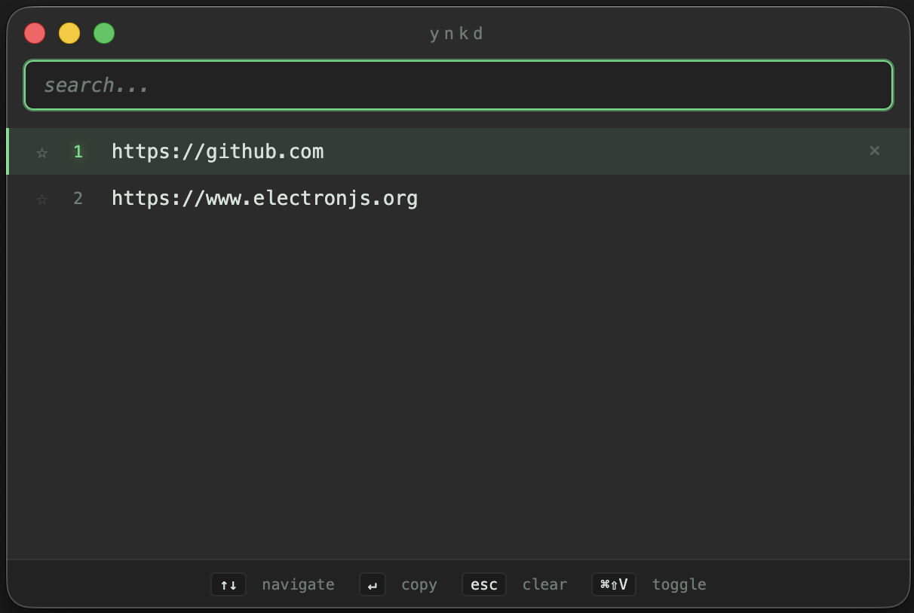

# ynkd

A tiny macOS clipboard manager, lives in menubar and keeps your last fifty copies in case you need one later. Summon with ⌘⇧V.



## Features
- **global hotkey** — `⌘⇧V` from anywhere pops it open
- **menubar icon** — quick access + show/hide + quit
- **remembers your last 50 copies** — old stuff falls off automatically
- **pin items** — pinned entries don't get evicted, ever
- **click to copy back** — selecting an entry puts it back on the clipboard, ready to paste
- **delete individual items** or clear everything (pinned stuff survives a clear)
- **respects concealed clipboard types** — password managers and other transient stuff won't get captured
- **persists between launches** — history saved to disk, comes back when you reopen


## Install

grab the latest `.dmg` from [Releases](https://github.com/Jbeardsley8/ynkd/releases), open it, drag ynkd into Applications.

**first launch: macOS will complain it's unsigned.** right-click the app → Open → Open anyway.

## How to use

- hit `⌘⇧V` to open the window from anywhere
- click an entry (or arrow + enter) to copy it back to your clipboard
- pin things you want to keep around
- close the window with the red button — it just hides, the app keeps running in the menubar
- right-click the menubar icon to clear history or quit

## Build from source

```bash
npm install
npm run dist
``` 

the `.dmg` lands in `release/`.

## Built with

electron · typescript · electron-builder

## Status

🚧 still building. works on my machine (apple silicon, macOS). things that might land next:

- search across history
- image clipboard support (currently text only)
- configurable hotkey + history size 